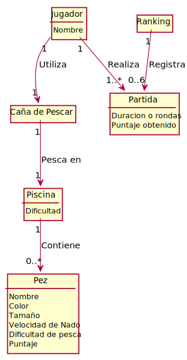

# Modelo de Dominio
A continuación se presenta y describe el modelo de dominio generado para el proyecto de "Pesca No Tan Milagrosa"



<details><summary>Codigo PlantUML</summary>
<p>

```
Advertencia: cada vez que se actualice el modelo, se debe volver a generar el archivo domain.svg y subirlo al repo.


@startuml Modelo_de_dominio

' Nombres Entidades
Class Pez
Class Piscina
Class "Caña de Pescar" as Cania
Class Ranking
Class Jugador
Class Partida

' Definición de entidades
Class Partida{
    Duracion o rondas
    Puntaje obtenido
}

Class Pez{
    Nombre
    Color
    Tamaño
    Velocidad de Nado
    Dificultad de pesca
    Puntaje
}

Class Piscina{
    Dificultad
}
Class Jugador{
    Nombre
}


' Relaciones de entidades

Partida "1..*" <-up- "1" Jugador: Realiza
Piscina "1" --> "0..*" Pez: Contiene
Ranking "1" --> "0..6" Partida: Registra
Jugador "1" --> "1" Cania: Utiliza
Cania "1" --> "1" Piscina: Pesca en


' Hiddes
hide class circle
hide empty members

@enduml
```

</p>
</details>